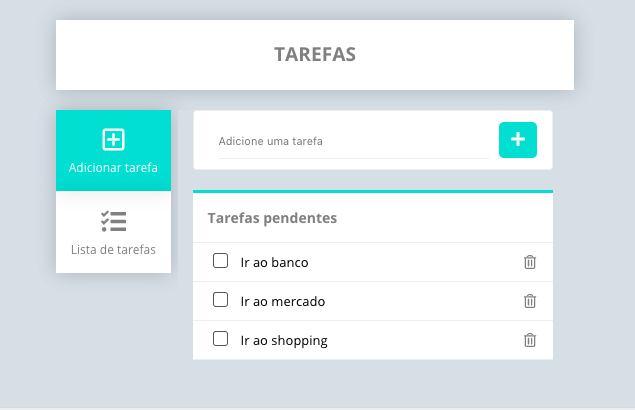

## React - To do List

## Interface



## Características e desenvolvimento

- Tela para adicionar tarefas e lista com tarefas pendentes
- Tela para busca de tarefas adicionadas e lista com todas as tarefas
- Reordenação de tarefas nas listas com um arrastar e soltar, sendo persistida a reordenação no localStorage
- Marcação para concluir uma tarefa
- Notificação de mensagens de erro e sucesso
- Tarefas persistidas no localStorage
- Design responsivo nos breakpoints 320px, 768px, 1024px e 1440px

## Tecnologias utilizadas

- React.js 16.9
- React-icon - Ícones do projeto
- React - Toastify
- Styled Components - Estilização de componentes
- React-router-dom - Roteamento
- Webpack - Ferramenta para build
- Javascript


## Como acessar o projeto

- Faça o download ou clone do repositório.

- Dentro da pasta do projeto, instalar as dependências
```
npm install ou yarn
```
- Rodar o projeto no servidor local
```
npm start ou yarn start
```
- Acesse http://localhost:3000


